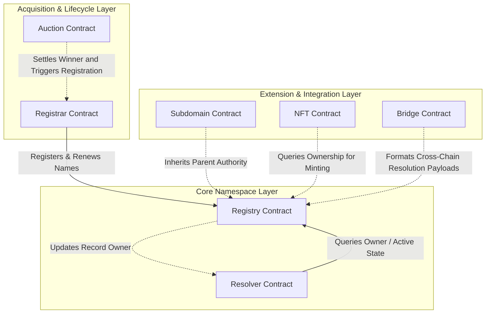

# High-Level Architecture Diagram

This diagram displays the structural organization and relationships of all 7 smart contracts inside the `xlm-ens` system.

## Contract Responsibilities

1. **Registry (`contracts/registry`)**:
   - **Role**: Canonical ledger for name records.
   - **State Changes**: Materializes and mutates `RegistryEntry` (owner, resolver, target address, metadata, expires_at).
   - **Auth**: Restricts modifications to authorized owners or registrar.

2. **Resolver (`contracts/resolver`)**:
   - **Role**: Map names to multi-chain target addresses and text records.
   - **State Changes**: Updates `ResolutionRecord` and `Primary` mappings.
   - **Auth**: Cross-contract invocation of `Registry::resolve` to verify owner matches caller.

3. **Registrar (`contracts/registrar`)**:
   - **Role**: Manages public registrations, quotes, and pricing policies.
   - **State Changes**: Processes registrations/renewals, collects fees, tracks metrics, and updates rate limits.
   - **Interactions**: Direct cross-contract call to `Registry::register` or `Registry::renew`.

4. **Auction (`contracts/auction`)**:
   - **Role**: Handles auction sales of premium names using Vickrey second-price logic.
   - **State Changes**: Manages bidding states (`Bid`) and refund/payment settlements.

5. **Subdomain (`contracts/subdomain`)**:
   - **Role**: Allows owners to create and delegate namespaces under registered parent domains.
   - **State Changes**: Stores `ParentDomain` controllers and `SubdomainRecord` child details.

6. **NFT (`contracts/nft`)**:
   - **Role**: ERC721-compliant tokenization of namespace ownership.
   - **State Changes**: Mints/transfers `TokenRecord` matching registry records.

7. **Bridge (`contracts/bridge`)**:
   - **Role**: Constructs deterministic Axelar GMP message payloads for cross-chain name resolving.
