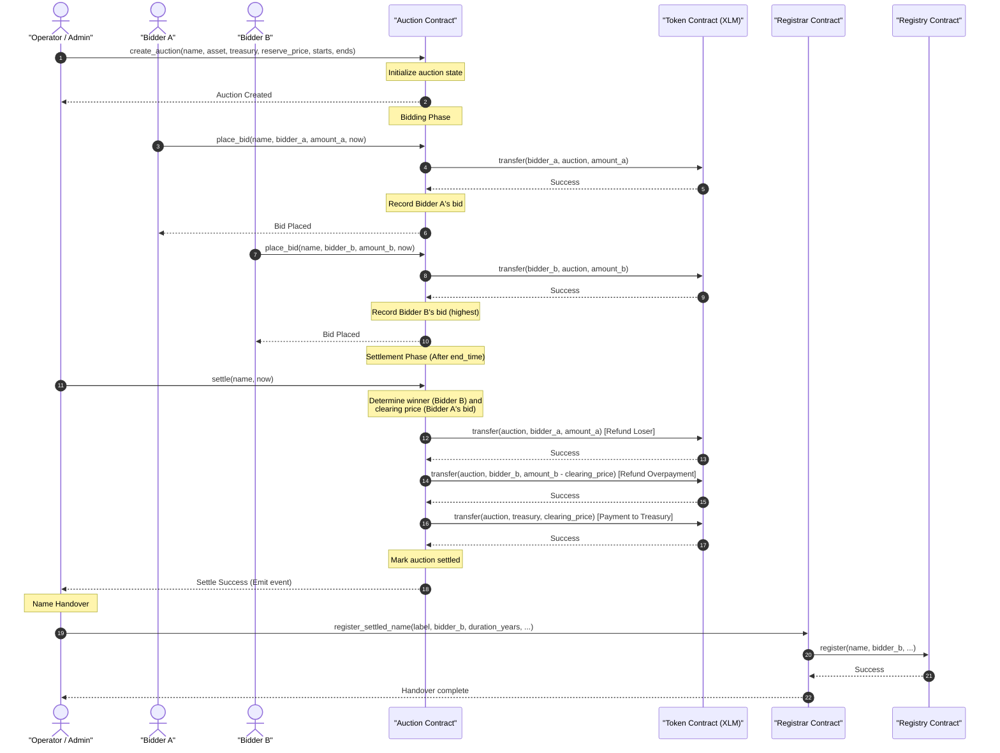

# Auction Flow Diagram (Vickrey Second-Price)

This diagram displays the sequence of steps for auctioning premium names. In public ledgers, commit-reveal schemes are recommended to keep bids secret until the reveal phase.

## Detailed Flow Steps

1. **Auction Initialization**: The Operator creates an auction on `AuctionContract` specifying the FQDN, asset used for bidding (e.g. XLM), reserve price, and bidding timeframes.
2. **Escrow Bidding**: Bidders place bids. To commit to the bid, the `AuctionContract` initiates a transfer to escrow the bidding tokens directly into the contract storage.
3. **Settlement Math**: When the bidding ends, the auction is settled. The settlement calculation:
   - Identifies the highest bidder.
   - Calculates the clearing price: the second highest bid or the reserve price, whichever is higher.
4. **Fund Distribution**:
   - Losers receive full refunds of their escrows.
   - The winner is refunded the difference between their bid and the second-price clearing price.
   - The clearing price is transferred to the configured treasury address.
5. **Ownership Handover**: Once settled, the operator registers the FQDN to the winner by invoking the `Registrar` which bypasses the reserved namespace rules and creates the registration entry in the `Registry`.
