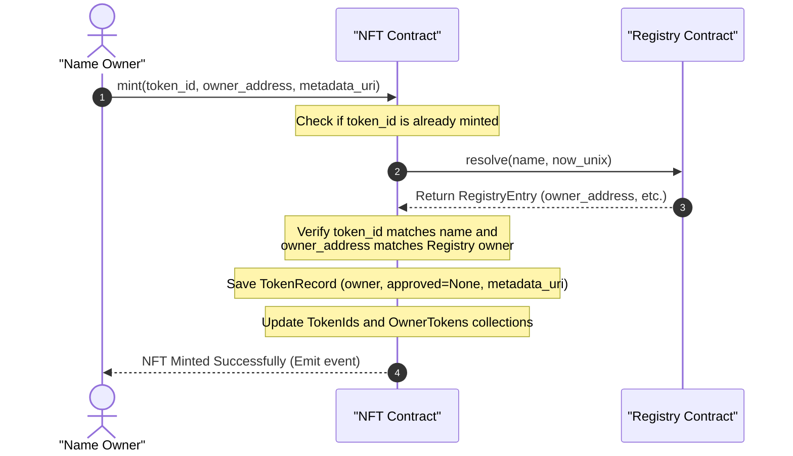

# NFT Minting Flow Diagram

This diagram displays the sequence of steps to tokenize name ownership as an NFT.

## Detailed Flow Steps

1. **Mint Request**: The owner of an active name requests tokenization by calling the `mint` function on the `NftContract`.
2. **Availability Check**: The `NftContract` checks its storage to verify that the `token_id` (derived from the FQDN hash or name) has not already been tokenized.
3. **Canonical Ownership Check**: The `NftContract` performs a cross-contract lookup calling `Registry::resolve` with the FQDN.
4. **Ownership Verification**: The `NftContract` compares the returned owner address from the `RegistryEntry` to the caller's target address to ensure only the active owner of the name can tokenize it.
5. **Mint Completion**:
   - Saves a new `TokenRecord` indicating the owner, approvals, and token metadata URI.
   - Appends the ID to the global supply index and owner token collections.
   - Emits a standard mint event.
6. **Marketplace Integration**: Once minted, the owner can call `approve` or `transfer` on the NFT contract, enabling trustless secondary marketplace listing of the name token.
