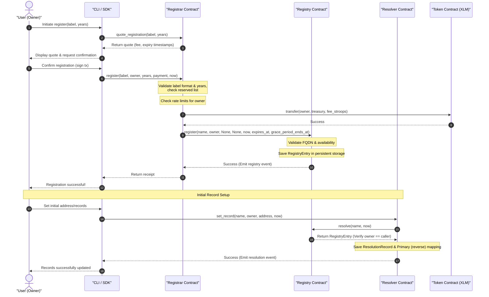

# Registration Flow Diagram

This diagram displays the sequence of steps for registering a name, from initial pricing quote to configuring initial resolution records.

## Detailed Flow Steps

1. **Quote Request**: The client requests a pricing calculation based on label length and registration years.
2. **Pricing Policy**: The `Registrar` calculates the annual fee tier (100 XLM for ≤3 characters, 25 XLM for 4-6, 10 XLM for ≥7 characters).
3. **Validation & Limits**:
   - Validation: Checks character validity (`a-z0-9-`) and length bounds.
   - Reserved List check: Ensures the label is not reserved.
   - Rate limiting: Rejects if the user has registered more than 5 names in 24 hours.
4. **Token Escrow**: The registration fee in stroops is transferred directly from the user to the treasury account.
5. **Registry Inception**: The `Registrar` makes a cross-contract invocation to `Registry::register`. The `Registry` writes a persistent `RegistryEntry` mapping the name to the owner and establishing expiration and grace period (90 days) boundaries.
6. **Initial Resolution Records**: The client invokes `Resolver::set_record` to setup forward address mapping. The `Resolver` performs an on-chain ownership check against the `Registry` via `Registry::resolve` before persisting the records and updating reverse lookup mappings.
