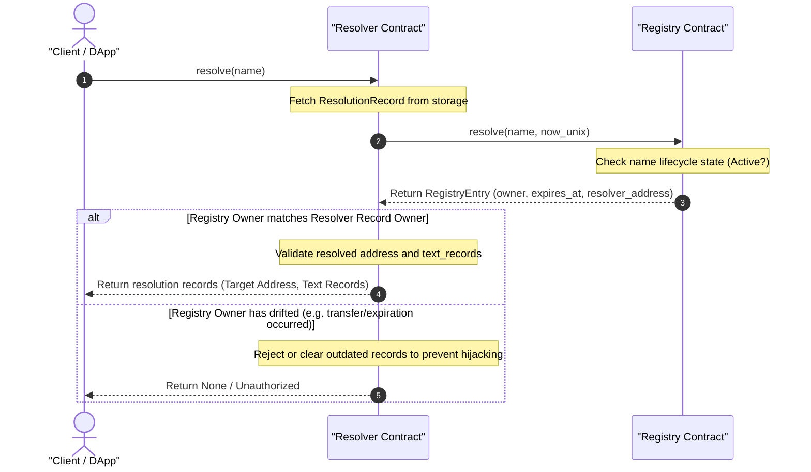

# Name Resolution Flow Diagram

This diagram displays how name resolutions are processed and how ownership checks are dynamically validated against the `Registry` to prevent stale record hijacking.

## Detailed Flow Steps

1. **Resolution Query**: The client queries the `Resolver` contract to resolve a name to its address or associated text records.
2. **Retrieve Resolver Record**: The `Resolver` fetches the mapping data stored under the `Forward(name)` persistent key.
3. **Cross-Contract Registry Query**: To ensure the records are authorized, the `Resolver` performs an on-chain invocation to `Registry::resolve`. The `Registry` checks:
   - If the name is active (not expired).
   - Who the current owner is.
4. **Ownership Verification**:
   - If the owners match: The `Resolver` returns the requested target address and text records.
   - If the owners do not match (due to a name being transferred or expiring and being re-claimed by a new user): The `Resolver` rejects the query or marks the records invalid. This prevents the previous owner from hijacking queries after losing ownership.
5. **Reverse Lookup**: Address-to-name reverse resolution is resolved using the `Primary(address)` records stored directly in the `Resolver`.
