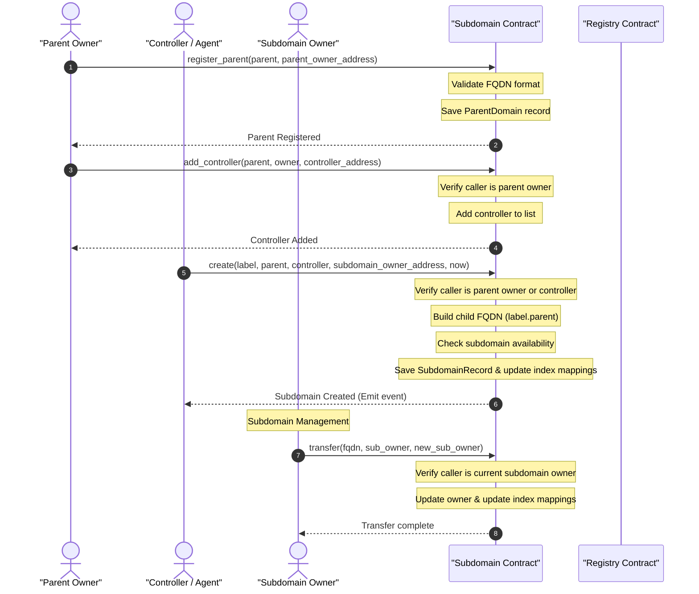

# Subdomain Flow Diagram

This diagram displays the sequence of steps for registering parent domains, managing controllers, and creating subdomains.

## Detailed Flow Steps

1. **Register Parent**: The parent domain owner must register the parent domain (e.g. `domain.xlm`) in the `Subdomain` contract to enable sub-namespace delegation.
2. **Delegate Authority**: The parent owner can whitelist other addresses as controllers, allowing them to create subdomains under that parent domain.
3. **Subdomain Creation**: A parent owner or controller calls `create`. The contract validates the sub-label, generates the fully-qualified domain name (e.g. `sub.domain.xlm`), and stores a new `SubdomainRecord` mapping the child name to its owner.
4. **Subdomain Isolation**: Subdomain lifecycles and records are managed independently within the `Subdomain` contract's namespace storage, separate from the primary `Registry` contract database.
