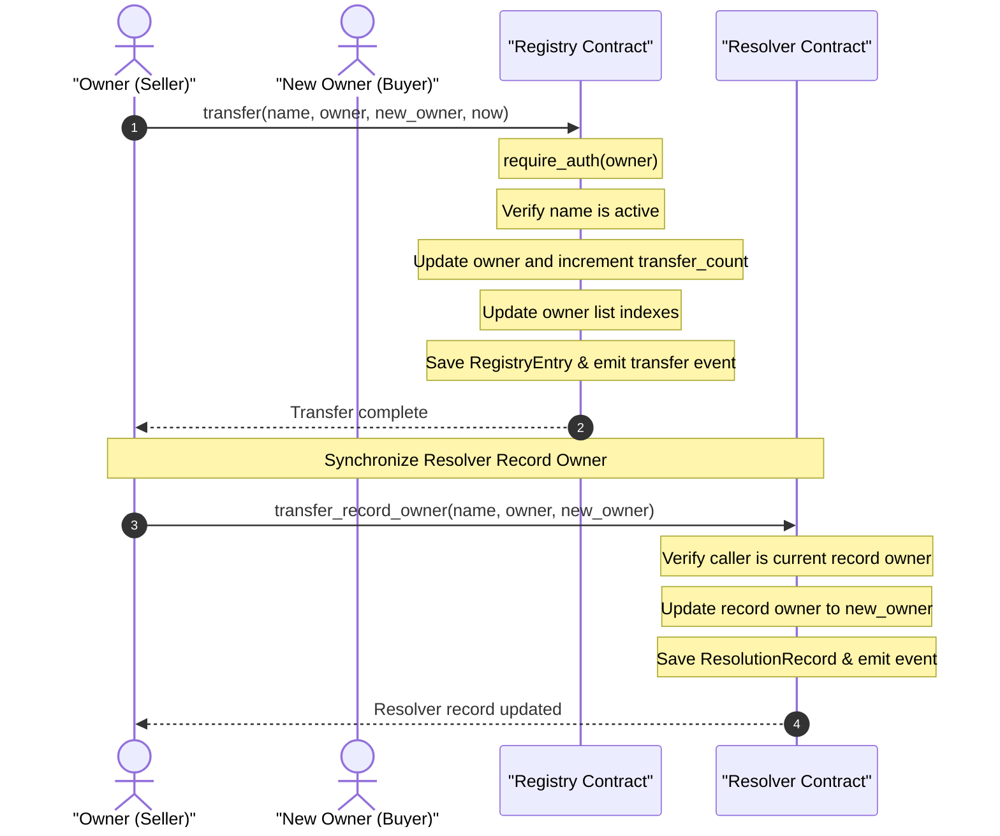

# Transfer Flow Diagram

This diagram displays the sequence of steps for transferring ownership of a name and updates to the corresponding resolver record.

## Detailed Flow Steps

1. **Initiate Transfer**: The owner initiates a transfer transaction targeting the name and the new owner address.
2. **Authority Check**: The `Registry` contract calls `require_auth(owner)` to verify that the active transaction signer matches the stored owner of the `RegistryEntry`.
3. **Active Status Verification**: The `Registry` checks the name lifecycle to ensure the domain is active (i.e., not expired or in a grace period).
4. **State Modifications**:
   - Updates the `owner` field to `new_owner`.
   - Increments the `transfer_count` counter.
   - Reindexes internal persistent storage collections mapping names to owners (`OwnerTokens`).
   - Emits a `transfer` event.
5. **Resolver Sync**: To prevent ownership drift (where the resolver record owner is different from the registry record owner), a call is made to `Resolver::transfer_record_owner` (or `Resolver::update_owner`). This synchronizes the record ownership within the Resolver contract, ensuring that only the new owner can write/modify the resolution address and text records going forward.
